#Skype for Business Android SDK


This lab will provide you an opportunity to jump into Android development while integrating Skype for Business components. Our objective is to create a sample app that allows an anonymous user to join an existing Skype meeting with chat, audio, and video capability.

**Prerequisites**: Before we get started, you must have a current Java SDK as well as Android Studio (IDE) installed on your computer.


##Setting Up
Open Android Studio, and select "Open an existing Android Studio project", shown here:
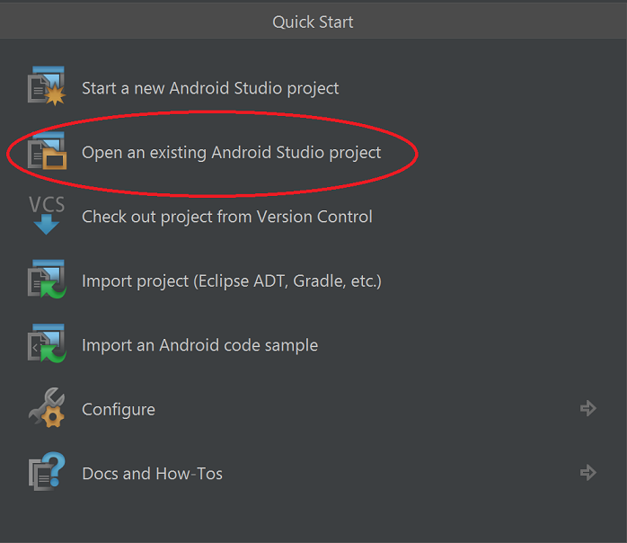

Once completed, open our starter project, SkypeAndroidDemo_Starter

If this option is not available (i.e. if your IDE opens to a recently saved project in Android Studio), you can also achieve this by navigating to File->Open... and selecting our starter solution from the resulting browser that opens.
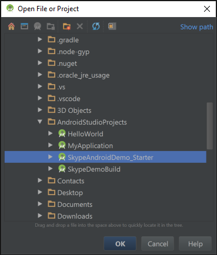

There will be a delay as the IDE opens the package, syncs necessary gradle files, and unpacks all included assets.

Let's set up the IDE for ease of use and consistency with the lab. Most of the settings used are the default, so you may not have to take any action here.

1. Set up your project view

    On the left-hand side of the IDE, click the vertical-aligned "Project" tab to open the project explorer window. At the top of that section, there is a dropdown on the left side. Make sure that "Android" is selected - this will allow us to work with our components more efficiently as we quickly complete our app.

	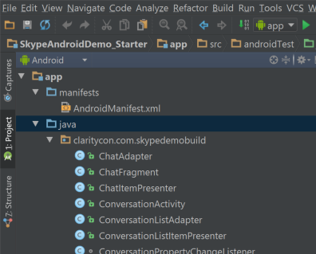

2. Optional: If you'd like to change your IDE color settings for readability as has been done in the demo, do the following:

    Navigate to File->Settings... (Ctrl+Alt+S), select the 'Appearance & Behavior' section, and expand its contents. Select 'Appearance'. Change the theme to Darcula as seen in the screenshot (dropdown) and press OK.
 
	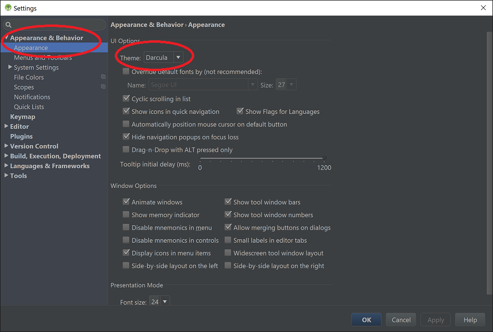
 
	Once completed, let's Run our application to make sure everything is working before we begin. Press the run button 
    
	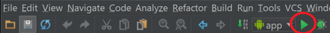 
    
	or on a PC, press Shift+F10.  Once the application is built and installed on the device,
	you should arrive at our main activity page that looks like the following:
    
	

Clicking the "Chat with Support" link will navigate us to our conversation join screen, but we do not have anything else wired up at the moment.  This starter solution has all UI components already prepared for you, in addition to some more specific adapter and listener classes which handle state changes and other more specific components which we won't be covering in this lab.  The three main files we will be working in are `MainActivity`, `JoinActivity`, and `ConversationActivity`. Their respective layouts are `activity_main.xml`, `activity_join.xml`, and `activity_conversations.xml`.  If you'd like to get an idea of what those look like before we begin, you can use the designer view in Android Studio. Open one of these files and click the 'Design' tab (by default in the lower-left corner of the editor for .xml layout files).

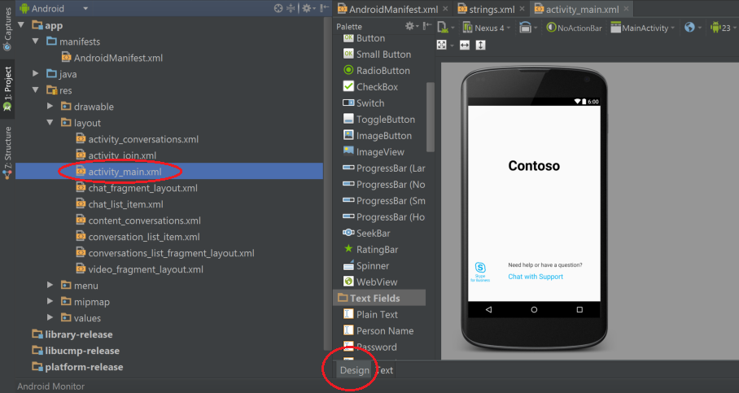

##Join a meeting 
In this section we'll be integrating Skype SDK code necessary to join a Skype meeting as an anonymous user. In order to join a meeting, we'll be providing a pre-determined meeting URI, as well as a user-entered display name provided in our app. Then, we'll wire up our 'Join' link to start our meeting via the SDK functionality. 

>Note:
>When joining a meeting, the audio and chat portions of the meeting will be started automatically. Depending on the meeting settings, the meeting organizer might have to admit the anonymous user to the meeting (the app will display that we are INLOBBY in this case while joining the meeting until admitted by an organizer). At the time of writing, the meeting organizer also needs to unmute the anonymous user in the host chatroom before the user is able to speak (regardless of toggling their mute button app-side, which we'll cover later)

1. First we need to create a Skype meeting. Go to your Office 365 home page and follow these instructions:
 
 Open your calendar
 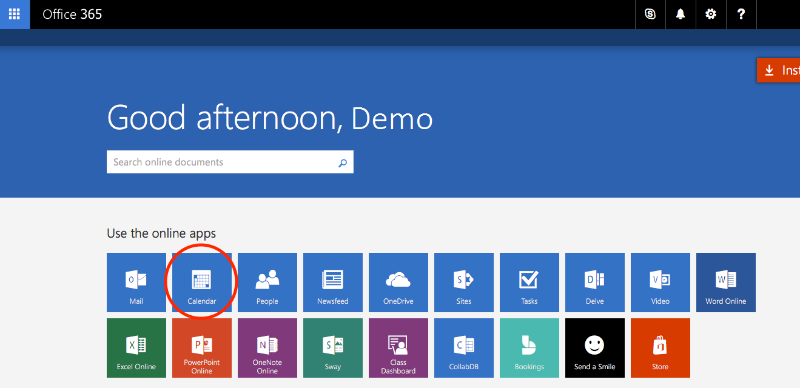  
 Click New to create a new meeting
 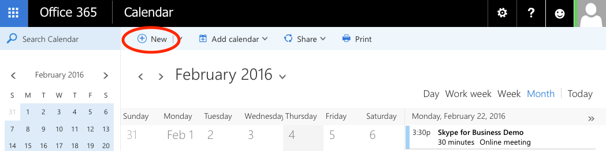
 Click add Skype to create the meeting URI
 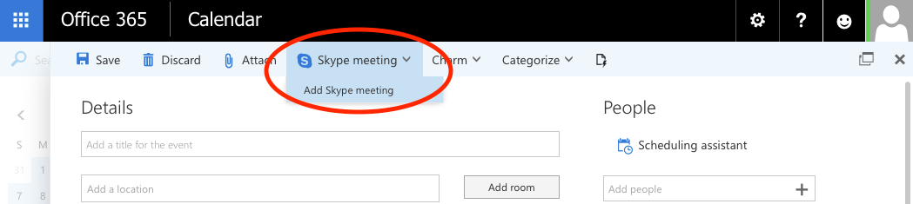
 Then click send to add it to your calendar so you can easily retrieve the link later
 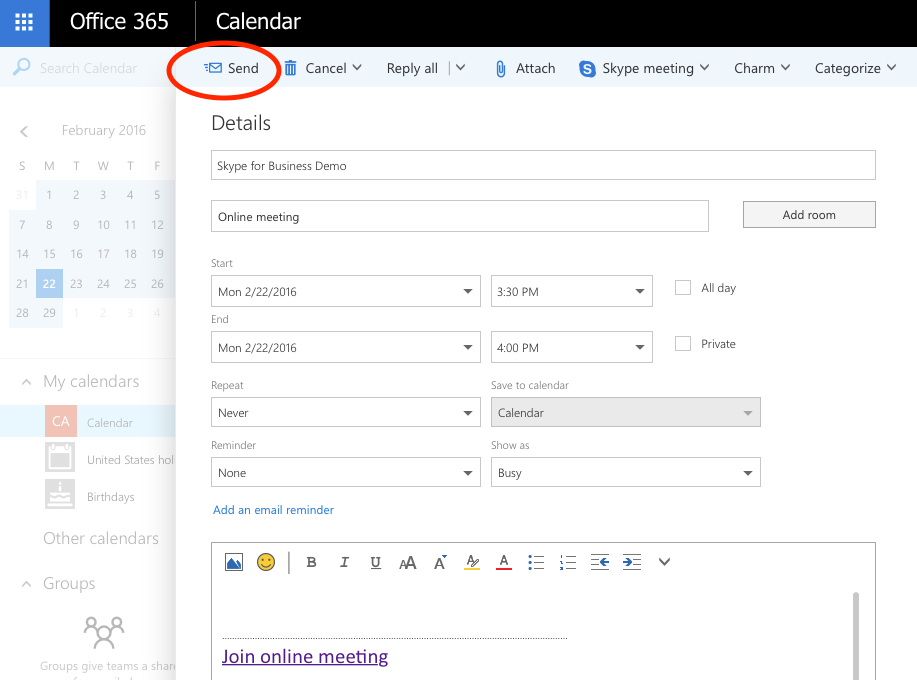
 
2. The activity_join.xml layout has the components that we will be interacting with in our app already set up for you as mentioned earlier. If you open the designer view of this file, you'll see that we have a text-entry field for entering our display name, as well as a join link for initiating our meeting.  If you switch to the 'Text' view of this file and look for the following code block, you'll see that we have an onClick action defined, with a value of "launchChat". Remember this as we continue on in this section.

```xml
   <TextView
   android:layout_width="wrap_content"
   android:layout_height="wrap_content"
   android:text="Join"
   android:id="@+id/joinConversation"
   android:layout_below="@+id/meetingUriName"
   android:layout_centerHorizontal="true"
   android:layout_marginTop="27dp"
   android:textColor="#00AFF0"
   android:textSize="20sp"
   android:onClick="launchChat"
   android:clickable="true"/>
```

3. First, we need to initialize some components that will be necessary for working with the SDK to join a meeting. Open `JoinActivity`, found under app>java>contoso.com.skypeandroiddemo_starter, and paste in the following immediately after the class declaration
 
 ```java
 public class JoinActivity extends AppCompatActivity {

    Application application = null;
    ConversationsManager conversationsManager = null;
    ConfigurationManager configurationManager = null;
    DevicesManager devicesManager = null;
    ConversationPropertyChangeListener conversationPropertyChangeListener = null;
    Conversation anonymousConversation = null;

    TextView conversationStateTextView = null;

    boolean meetingJoined = false; 
 ...
 }
 ```
 In the code above we have declared and initialized a number of objects necessary for interacting with our Skype meeting. Starting with our `Application` object, this is our top level property needed for the SDK, and is initialized by calling the `.getInstance()` function (we'll implement this in a moment). From there, we then have access to the `ConversationManager` and `ConfigurationManager`. The `DevicesManager` is what will allow us to interact with our speakerphone, microphone, front and rear facing camera on our device. The `Conversation` is going to play a critical role in keeping track of all conversations that you are joined to, and the subsequent activity that occurs within them. For this tutorial, we will only be joining one conversation. 
 
 Finally, the `ConversationPropertyChangeListener` is what will monitor changes in Conversation status as we establish our connection to the meeting.
 
4. Let's assign the values of these components in our `onCreate()` method - paste the following code
```java
    @Override
    protected void onCreate(Bundle savedInstanceState) {
        super.onCreate(savedInstanceState);
        setContentView(R.layout.activity_join);

        Toolbar myToolbar = (Toolbar) findViewById(R.id.my_toolbar);
        setSupportActionBar(myToolbar);

        ActionBar actionBar = getSupportActionBar();
        actionBar.setDisplayHomeAsUpEnabled(true);

        this.conversationStateTextView = (TextView)findViewById(R.id.conversationState);
        this.application = Application.getInstance(this.getApplication().getApplicationContext());
        this.conversationsManager = application.getConversationsManager();
        this.configurationManager = application.getConfigurationManager();
        this.devicesManager = application.getDevicesManager();
    }
```
 By making use of additional SDK components (such as `application.getConversationsManager()`), we've initialized all of our conversation components necessary for joining meeting.
 
5. Let's quickly add our `onDestroy()` method as well - this is where some basic cleanup will occur when the `JoinActiviy` is completed. Paste the following into `onDestroy()`
 ```java
    @Override
    protected void onDestroy() {
        this.conversationsManager = null;
        this.configurationManager = null;
        this.application = null;
        super.onDestroy();
    } 
 ```
 
6. Now let's implement the `launchChat` function mentioned earlier - this is where we will attempt to join the meeting with our display name and meeting URI when the join button is pressed. Paste the following code into the launchChat function
 ```java
     public void launchChat(View view) {

        InputMethodHelper.hideSoftKeyBoard(this.getApplication().getApplicationContext(),
                view.getWindowToken());

        if (meetingJoined) {
            // Leave the meeting.
            try {
                this.anonymousConversation.leave();
                this.meetingJoined = false;

            } catch (SFBException e) {
                e.printStackTrace();
            }
        } else {
            //Join the meeting.
            // Get the display name.
            final android.widget.EditText displayNameTextView =
                    (android.widget.EditText) findViewById(R.id.meetingUriName);
            this.configurationManager.setDisplayName(displayNameTextView.getText().toString());

            // Get the meeting uri
            String meetingUriString = "https://example.contoso.com/buildDev/SD7F897";
            URI meetingUri = URI.create(meetingUriString);

            // Join meeting and monitor conversation state to determine meeting join completion.
            try {

                // Set the default device to Speaker
                this.devicesManager.setActiveEndpoint(DevicesManager.Endpoint.LOUDSPEAKER);

                if (this.conversationsManager.canGetOrCreateConversationMeetingByUri()) {
                    this.anonymousConversation = conversationsManager.getOrCreateConversationMeetingByUri(meetingUri);
                    this.conversationStateTextView.setText("JOINING");
                    // Conversation begins in Idle state. It will move from Idle->Establishing->InLobby/Established
                    // depending on meeting configuration.
                    // We will monitor property change notifications for State property.
                    // Once the conversation is Established, we will move to the next activity.
                    this.conversationPropertyChangeListener = new ConversationPropertyChangeListener(this, this.anonymousConversation);
                    this.anonymousConversation.addOnPropertyChangedCallback(this.conversationPropertyChangeListener);
                } else {
                    this.showAlert("Cannot join meeting. canGetOrCreateConversationMeetingByUri false");
                }
            } catch (SFBException e) {
                e.printStackTrace();
            }
        }
    }
 ```
 The first check we perform is to see if we're already in the meeting via the `meetingJoined` variable - if we're somehow at the meeting join screen and have an active meeting session, we'll end it when pressing the "Join" link. That way, pressing the link a second time will join the meeting gracefully. 
 
 Assuming the normal flow from the main screen - i.e. we are not in a meeting - let's join one! We set a display name based on what the user entered.
 >Note:
 >The SDK requires a display name for joining conversations - if none is found, we are defaulting to "John Doe". Additional handling could be set up to address this and interact with the user, but for the purposes of keeping this demo simple, we'll take this approach instead.
 
 We then set the meeting URI - replace the value of `meetingUriString` with the meeting URI you created earlier.

 In the try/catch block that follows, we initiate our meeting. The audio device is set to speakerphone by default, a connection to our meeting is attempted, and the meeting connection status is set on a UI element - `conversationStateTextView`. Finally, a property state change listener is set on the the meeting connection to monitor activity.

 In order to allow the SDK time to fully establish connection and set up the meeting for us to join into, we don't immediately try to jump into the conversation view after calling `getorCreateConversationMeetingByUri`. This is where the property state change listener comes into play. For context, let's take a look in `ConversationPropertyChangeListener` (an included class already completed for this demo). You will see we are doing two things: a JoinActivity is initialized in the constructor of this class, and an overridden `onPropertyChanged` method is implemented. In `onPropertyChanged`, we make a call to another function in our JoinActivty class - `updateConversationState()`. This is where the transition to the meeting screen will take place.
 
 Open `JoinActivity` again, and let's paste the following code into our `updateConversationState()` function:
 ```java
     /**
     * Determines meeting join state based on conversations state.
     */
    public void updateConversationState() {
        Conversation.State state = this.anonymousConversation.getState();
        this.conversationStateTextView.setText(state.toString());
        switch (state) {
            case ESTABLISHED:
                this.meetingJoined = true;
                break;
            case IDLE:
                this.meetingJoined = false;
                if (this.anonymousConversation != null) {
                    this.anonymousConversation.removeOnPropertyChangedCallback(this.conversationPropertyChangeListener);
                    this.anonymousConversation = null;
                }
                break;
            default:
        }

        if(meetingJoined) {
            Intent intent = new Intent(this, ConversationActivity.class);
            startActivity(intent);
        }
    }
```
 This function does two potential things each time the conversation state is altered (via operations in the SDK meeting join code): the value of our `conversationStateTextView` is updated (pictured below), and the value of `meetingJoined` is set appropriately. If we've joined the meeting successfully, we'll navigate to our Conversation view.
 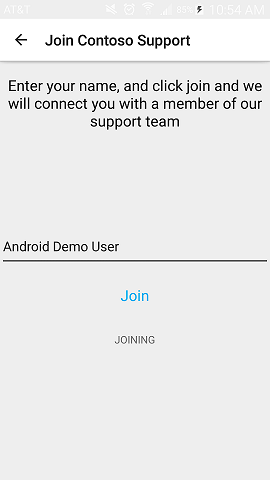
 At this point, we've added all necessary code to join our meeting.  If you run the application, click "Chat with Support", provide a display name in the text field and click "Join", you will navigate to the conversation activity. To test the app, start the meeting that you created earlier by clicking the link you generated and emailed yourself. Make sure you are also joined to the meeting as the *organizer* .
 
 When you click join on the device you should see the anonymous user join the meeting with the display name you entered in the app. Since the meeting audio is started automatically, you will also be able to hear anyone else in the meeting from the device (they can't hear your device input however, as you start the meeting muted, but that will be fixed in a later section).  Your device screen should look like the following after joining:
 
 >Note:
 >When using the default meeting settings in Skype for Business, any anonymous users need to be admitted into the meeting before they can fully join. For ease of testing, you might want to disable this option so that the anonymous user is admitted automatically to the meeting, and then leave the meeting running as we continue to develop the app.

##Adding Audio
In this section we will wire up our audio button (/). This will allow the user to un-mute and talk in the audio call. Click this button will toggle between muted () and un-muted () states.
 >Note:
 >At the time of writing, the anonymous users join the call in a muted state. Before the user can un-mute themselves, the meeting organizer must un-mute them first. After this the muted and un-muted states can be toggled by the user.

##Muting and Un-muting
1. Open the `ConversationActivity` file. Just like the previous Activity, all methods/functions have been set up for you, and we will be populating the necessary code components to make things functional.

2. First we need to set up some of the necessary properties we'll be working with. Inside of the `ConversationActivity` class declaration, add the following code:

```java
public class ConversationActivity extends AppCompatActivity implements ConversationsListFragment.FragmentInteractionListener, ChatFragment.ChatFragmentInteractionListener {

// ConversationsList fragment for displaying the conversations list.
private ConversationsListFragment conversationsListFragment = null;

// Chat fragment for IM.
private ChatFragment chatFragment = null;

// Video Fragment.
private VideoFragment videoFragment = null;
private Conversation currentConversation = null;
private DevicesManager devicesManager = null;

DevicesManager.Endpoint endpoint = null;
Menu localMenu = null;
MenuItem muteButton = null;
MenuItem speakerButton = null;
MenuItem videoButton = null;
Toolbar conversationToolBar = null;

...
}
```
This initializes the two fragments we'll be working with to display the chat messages/history and video feeds, as well as the current conversation, devices manager, and the buttons that we'll want to set toggle actions on.

3. Next, in the `onCreate()` method, add the following code:
 ```java
    // For anonymous meeting join, there will only be a single conversation in the list.
    this.currentConversation = (com.microsoft.office.sfb.appsdk.Application.getInstance(
            this.getApplicationContext()).getConversationsManager().getConversations()).get(0);
 
    this.conversationToolBar = (Toolbar) findViewById(R.id.conversation_toolbar);
    setSupportActionBar(this.conversationToolBar);
 ```
 This assigns our current conversation, and populates our ActionBar with the contents of our menu we have set up in app>res>menu>menu_conversation.xml. Check out the contents of that file if you'd like to see what our menu items look like and how they are set up. The conversation object is important, as it's how we manage all interactions with the skype meeting, including the various inputs and outputs (like our microphone, speakers, and camera feed).
 
4. Next, add the following code to the overridden `onCreateOptionsMenu()`
 ```java
     @Override
    public boolean onCreateOptionsMenu(Menu menu) {
        // Inflate the menu; this adds items to the action bar if it is present.
        getMenuInflater().inflate(R.menu.menu_conversation, menu);
        localMenu = menu;
        muteButton = menu.findItem(R.id.audio_button);
        speakerButton = menu.findItem(R.id.speaker_button);
        videoButton = menu.findItem(R.id.enable_video);
        return true;
    }
 ```
 We're adding more than is necessary for the mute/unmute functionality, but we'll need these objects soon. For now, we're setting up the menu and individual items that we will be interacting with - the mute/unmute, speaker, video and end call buttons. More on the rest of those to come, for now let's handle what happens when we press our mute/unmute button.
 
5. Complete the `updateMuteButton()` function to handle toggling our menu button icon when pressed:
 ```java
public void updateMuteButton(boolean isMuted) {
        if(isMuted) {
            muteButton.setIcon(R.drawable.fabrikam_skypecontrol_endcall);
        } else {
            muteButton.setIcon(R.drawable.fabrikam5k_team_call_icon);
        }
    }
 ```
 This will display to the user that they have un-muted or muted themselves on the call.
 
6. Add the handler event for when our mute button is pressed by pasting this code into `onOptionsItemSelected()`
 ```java
@Override
public boolean onOptionsItemSelected(MenuItem item) {
    // Handle action bar item clicks here. The action bar will
    // automatically handle clicks on the Home/Up button, so long
    // as you specify a parent activity in AndroidManifest.xml.
    switch(item.getItemId()) {
        case R.id.audio_button:
            boolean isMuted = this.currentConversation.getSelfParticipant().getParticipantAudio().isMuted();
            if (this.currentConversation.getSelfParticipant().getParticipantAudio().canSetMuted()) {
                try {
                    this.currentConversation.getSelfParticipant().getParticipantAudio().setMuted(!isMuted);
                } catch (SFBException e) {
                    e.printStackTrace();
                }
            }
            updateMuteButton(this.currentConversation.getSelfParticipant().getParticipantAudio().isMuted());
            break;
        default:
            break;
    }
    return super.onOptionsItemSelected(item);
}
    ```
 We'll be adding the behavior for the rest of the menu items to this section shortly. For now, just know that this method is wiring up the menu items and dictating the behavior that occurs when one of them is selected. We observe the current conversation and participant properties each time that this menu item is selected. We then mute or unmute the participant based on the `isMuted()` function result.  We then call to our `updateMuteButton()` with the current `isMuted()` result (after we've just udpated this value).
 
 
7. In order to test out that everything is working, let's run our application again. Make sure that the anonymous user is no longer shown in the meeting on the host computer. If they are, right click their user and Remove them from the meeting. Then, if the app if it is still running on your device, kill it and run the project again from Android Studio. We'll now have a new version of the app with our changes installed on your device. If everything is working correctly, you will see the user once again join the meeting. Right click them and Un-mute them from the host meeting (on your PC). Now, press the mute button () on the device screen. The button should update it's icon to be the active version (), and you should be able to hear input from the device in the host meeting. 
 
 
 >Note:
 >If you mute the microphone from the device, it will re-mute both the device and the anonymous user in the conversation. If you want to speak again, the host will have to un-mute you again before you press the mute button.
 >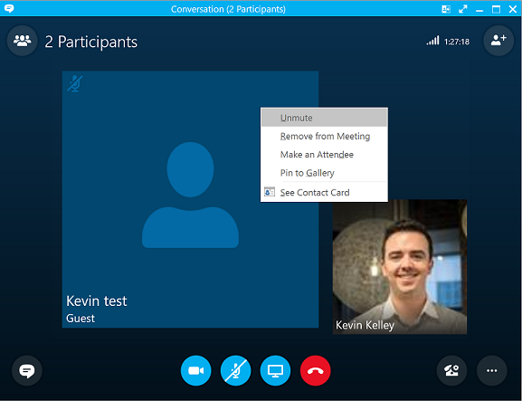

##Switching Speakers
1. To switch from the default speakerphone to the device headset speaker, we will need to make use of the `DevicesManager` we initialized earlier. Add the following code to the `onCreate()` method of the `ConversationActivity` class:
 ```java
   this.devicesManager = com.microsoft.office.sfb.appsdk.Application.getInstance(
        this.getApplicationContext()).getDevicesManager();
   this.endpoint = this.devicesManager.getActiveEndpoint()
 ```
 This is going to allow us direct access to some of the hardware controls of the phone via the SDK, as well as capturing the current speaker setting. By default, it is set to the speakerphone, but we are tracking this value via `this.endpoint`.
 
2. Add the following function to our class - similar to `updateMuteButton()`, this will handle the toggling of our menu icon when selected
 ```java
     public void updateSpeakerButton() {
        if(this.devicesManager.getActiveEndpoint() == DevicesManager.Endpoint.LOUDSPEAKER) {
            speakerButton.setIcon(R.drawable.fabrikam_skypecontrol_mic);
        } else {
            speakerButton.setIcon(R.drawable.fabrikam_mic_off);
        }

    }
 ```
3. Add an additional case to our menu item switch statement in the `onOptionsSelected()` method:
 ```java
 case R.id.speaker_button:
    switch(this.devicesManager.getActiveEndpoint()) {
        case LOUDSPEAKER:
            this.devicesManager.setActiveEndpoint(DevicesManager.Endpoint.NONLOUDSPEAKER);
            break;
        case NONLOUDSPEAKER:
            this.devicesManager.setActiveEndpoint(DevicesManager.Endpoint.LOUDSPEAKER);
            break;
    }
    updateSpeakerButton();
    break;
 ```
 This is toggling between the Speakerphone (`LOUDSPEAKER`/) and Headset speaker (`NONLOUDSPEAKER`/), as well as toggling the icon via `updateSpeakerButton()` which we just added.

4. Now that we've got the event-handling set up, run a clean instance of the app and test out our new code. You should be able to toggle between the speakerphone and headset speaker on your device to hear audio from the meeting.


##Displaying Conversation History and Chat Messages
In this section we will update the `ConversationActivity` class once again, implementing a Fragment which will hold our chat components. This will allow you to view any sent messages, as well as activity such as users entering and leaving the conversation.

###Setting up the Conversation Display
1. Modify the `onCreate()` method so that we now have the following:
 ```java
@Override
protected void onCreate(Bundle savedInstanceState) {
    super.onCreate(savedInstanceState);
    setContentView(R.layout.activity_conversations);

    if (findViewById(R.id.fragment_container) != null) {

       // For anonymous meeting join, there will only be a single conversation in the list.
       this.currentConversation = (com.microsoft.office.sfb.appsdk.Application.getInstance(
                this.getApplicationContext()).getConversationsManager().getConversations()).get(0);

       this.devicesManager = com.microsoft.office.sfb.appsdk.Application.getInstance(
                this.getApplicationContext()).getDevicesManager();
       this.endpoint = this.devicesManager.getActiveEndpoint();

       // Create the chat fragment.
       this.chatFragment = ChatFragment.newInstance(this.currentConversation);

       FragmentTransaction fragmentTransaction = getFragmentManager().beginTransaction();
       fragmentTransaction.add(R.id.fragment_container, this.chatFragment, null);
       fragmentTransaction.setTransition(FragmentTransaction.TRANSIT_FRAGMENT_OPEN);

       // Load the fragment.
       fragmentTransaction.commit();
    }

    this.conversationToolBar = (Toolbar) findViewById(R.id.conversation_toolbar);
    setSupportActionBar(this.conversationToolBar);
}
    ```
 We've accomplished a few things in this code that we've just added. First, we are viewing the conversation that has just been joined from the app. The way that the SDK is intended to work is for one user to join one meeting - we won't be displaying multiple conversations like in your Skype for Business client on your PC. We initialized a new instance of a ChatFragment, which is used to interact with each component of the conversation. We then bind the fragement_container (see `content_conversations.xml` under res>layout) and the ChatFragment we just initialized, and finalize the process by committing the fragment. 
 
 >Note:
 >There are a number of methods and functions that are already set up for you inside both of the `ChatFragment` and `ChatAdapter` classes that will handle the intricate details of the chat conversation, but at a high level they accomplish the following: initialize and bind the app's ability to send messages via a `EditText` component and Send button, intialize the individual `ChatFragment` objects (user activity and messages), and render them inside of a `RecyclerView`. Then, the `ChatAdapter` sets a listener on the conversation to manage property changes (such as a new message being sent) which will in turn repeat the processes in place displaying our conversation components as they occur. In this demo we won't get into the property listeners or the SDK code. 

 For now, let's take a look at the `ChatAdapter` class and quickly examine the setup process. First, there is the `onCreateView()` method. This inflates our `chat_fragment_layout.xml` with an `EditText` widget and Send button, as well as the `RecyclerView` which will hold the `CardView` objects which will be populated with our message and participant activity items.  It then sets up event listeners to process activity, and returns the view. Next, it wires up the Send button press event with `onSendButtonclicked()`. As you can propbably guess, this takes the text entered by the anonymous user in the app and sends it via a chat service in the conversation. It then clears out the EditText widget so that it is ready for the user to send another message. 

2. Back in `ConversationActivity`, we need to add one more function to handle navigating between fragments and reloading our conversation. Add the following to `onConversationSelected()`
 ```java
 /**
 * The ConversationsList fragment calls this callback method when a conversation is selected
 * in the list.
 * @param itemIndex index of the conversation selected.
 */
@Override
public void onConversationSelected(int itemIndex) {
    // Get the conversation from the list.
    Conversation conversation = (com.microsoft.office.sfb.appsdk.Application.getInstance(
            this.getApplicationContext()).getConversationsManager().getConversations()).get(itemIndex);

    // Create the chat fragment.
    this.chatFragment = ChatFragment.newInstance(conversation);

    FragmentTransaction fragmentTransaction = getFragmentManager().beginTransaction();

    // Hide the current fragment.
    fragmentTransaction.hide(conversationsListFragment);
    fragmentTransaction.add(R.id.fragment_container, this.chatFragment, null);
    fragmentTransaction.setTransition(FragmentTransaction.TRANSIT_FRAGMENT_OPEN);

    // Add transaction to back stack so that "back" button restores state.
    fragmentTransaction.addToBackStack(null);

    // Load the fragment.
    fragmentTransaction.commit();
    }
    ```
 
 At this point, we have everything we need to see incoming messages from the conversation on our device, as well as contributing to the conversation view the EditText and Send button that have already been set up for you. Let's run and test the app again - try sending a message from the device and from the host and observe them in the app.
 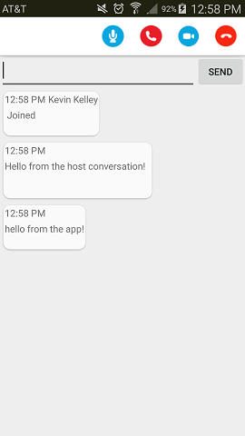
 
##Joining a Video Call
In this section we will enable our app to escalate the conversation to a video call. Our video view will display a full-screen of the video from the current dominant speaker in the conversation. Additionally, a small video displaying our current camera (front or back depending on the device and selection) will be shown in the bottom right corner of the screen.

###Start the Video Call
We'll be working in `ConversationActivity` again as we wire up video capability in our conversation. We've already performed some of the work necessary to get our video call started. We initialized our `VideoFragment`, and we already have a menu button that we'll interact with to switch to the video conversation. In the `onOptionsItemSelected()` method, let's add another case to our switch statement:
 ```java
 case R.id.enable_video:
    this.videoFragment = VideoFragment.newInstance(this.currentConversation, devicesManager);

    FragmentTransaction fragmentTransaction = getFragmentManager().beginTransaction();

    // Hide the current fragment.
    fragmentTransaction.hide(this.chatFragment);
    fragmentTransaction.add(R.id.fragment_container, this.videoFragment, null);
    fragmentTransaction.setTransition(FragmentTransaction.TRANSIT_FRAGMENT_OPEN);

    // Add transaction to back stack so that "back" button restores state.
    fragmentTransaction.addToBackStack(null);

    // Load the fragment.
    fragmentTransaction.commit();

    //set speakerphone as active if it isn't already
    if(this.devicesManager.getActiveEndpoint() == DevicesManager.Endpoint.NONLOUDSPEAKER) {
        this.devicesManager.setActiveEndpoint(DevicesManager.Endpoint.LOUDSPEAKER);
    }

    //remove buttons
    videoButton.setVisible(false);
    speakerButton.setVisible(false);
    muteButton.setVisible(false);
    onPrepareOptionsMenu(localMenu);

    break;
 ```
 This is very similar to our conversation fragment, which is the default view of our conversation when we join. Now, instead of navigating to another activity when pressing our video button, we are simpy going to display another fragment, and add to our 'back stack', which is used when the app user presses the back button on their phone or when they use the navigational back button (which we'll add a little later on).
 
 We create a new instance of a video fragment, initialize our local video fragment we created earlier, go through the same binding process of the `fragment_container` as we did with the ChatFragment, and finally we set the loudspeaker if it is not already active. The thinking behind this is that a user won't want to hold their device to their ear when viewing a video. For look and feel, we're also temporarily modifying the menu items. We're hiding the video button (as we'll already be in the video call), speaker button (as we've already set that for the user), and mute button (a video chat without audio wouldn't be very useful to us). We then call `onPrepareOptionsMenu()` and pass in `localMenu` - this redraws the menu in its current state, i.e. with our 3 buttons having their visibility turned off.
 
 Let's look at `VideoFragment` to see some of the details on how our video is working. Look in the `onCreateView()` method - we start by inflating our `video_fragment_layout.xml`, initializing and setting a property listener on our video service (SDK component). Then we capture the anonymous user video feed, initialize the pause and camera switch buttons and set their respective `onClick()` response functions, and finally capture the conversation video (dominant speaker). A little farther down, you can see how the `onPauseClick()` simply pauses/un-pauses the anonymous user's video feed to the conversation, and the `onCameraSwitch()` flips the cameras between front and rear-facing on the app device.
 
You should have all necessary components wired to test the conversation video. Run the app again and after connecting to the conversation, press the video button to escalate to video. If your PC has a webcam, enable it in the conversation and you will be able to see both devices displaying. If additional members join the conversation with enabled webcams and begin speaking, you will see the app video switch back and forth between speakers (whoever is 'dominant' in the conversation at the moment - usually one person while others are muted or not talking).
 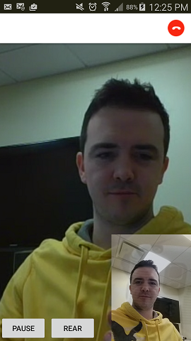


 
##Enabling Navigation
We haven't yet focused on some of the more common controls of an Android app like navigation. Specifically, we haven't handled the 'back' action, or how ro gracefully leave the meeting. We'll handle this with a default Android navigation control, and an End Call button for the app user.
###Leaving the Meeting
We've already had our end call button in the menu since we've added it. If you've tried pressing it so far though, you likely got an error or no result at all. We'll quickly wire that up so that a user may leave the conversation, and join back again without issue.

1. Back in `ConversationActivity` again, we'll be finalizing our `onOptionsItemSelected()` to include the response for our End Call button being pressed. Since we'll be completing this method, make sure your code looks like the following:

 ```java
 @Override
public boolean onOptionsItemSelected(MenuItem item) {
    // Handle action bar item clicks here. The action bar will
    // automatically handle clicks on the Home/Up button, so long
    // as you specify a parent activity in AndroidManifest.xml.
    switch(item.getItemId()) {
        case R.id.speaker_button:
            switch(this.devicesManager.getActiveEndpoint()) {
                case LOUDSPEAKER:
                    this.devicesManager.setActiveEndpoint(DevicesManager.Endpoint.NONLOUDSPEAKER);
                    break;
                case NONLOUDSPEAKER:
                    this.devicesManager.setActiveEndpoint(DevicesManager.Endpoint.LOUDSPEAKER);
                    break;
            }
            updateSpeakerButton();
            break;
        case R.id.audio_button:
            boolean isMuted = this.currentConversation.getSelfParticipant().getParticipantAudio().isMuted();
            if (this.currentConversation.getSelfParticipant().getParticipantAudio().canSetMuted()) {
                try {
                    this.currentConversation.getSelfParticipant().getParticipantAudio().setMuted(!isMuted);
                } catch (SFBException e) {
                    e.printStackTrace();
                }
            }
            updateMuteButton(this.currentConversation.getSelfParticipant().getParticipantAudio().isMuted());
            break;
        case R.id.enable_video:
            this.videoFragment = VideoFragment.newInstance(this.currentConversation, devicesManager);

            FragmentTransaction fragmentTransaction = getFragmentManager().beginTransaction();

            // Hide the current fragment.
            fragmentTransaction.hide(this.chatFragment);
            fragmentTransaction.add(R.id.fragment_container, this.videoFragment, null);
            fragmentTransaction.setTransition(FragmentTransaction.TRANSIT_FRAGMENT_OPEN);

            // Add transaction to back stack so that "back" button restores state.
            fragmentTransaction.addToBackStack(null);

            // Load the fragment.
            fragmentTransaction.commit();

            //set speakerphone as active if it isn't already
            if(this.devicesManager.getActiveEndpoint() == DevicesManager.Endpoint.NONLOUDSPEAKER) {
                this.devicesManager.setActiveEndpoint(DevicesManager.Endpoint.LOUDSPEAKER);
            }

            //remove buttons
            videoButton.setVisible(false);
            speakerButton.setVisible(false);
            muteButton.setVisible(false);
            onPrepareOptionsMenu(localMenu);

            break;
        case R.id.end_call:
            try {
                this.currentConversation.leave();
            } catch (SFBException e) {
                e.printStackTrace();
            }
            Intent intent = new Intent(this, MainActivity.class);
            intent.addFlags(Intent.FLAG_ACTIVITY_CLEAR_TOP | Intent.FLAG_ACTIVITY_NEW_TASK);
            startActivity(intent);
            finish();
        case android.R.id.home:
            onBackPressed();
        default:
            break;
    }
    return super.onOptionsItemSelected(item);
}
    ```
We've added our case for `R.id.end_call`, which will set our intent back to the MainActivity, clear all 'back stack' elements (so that pressing back won't take us from the MainActivity to a dead JoinActivity screen for instance), and then navigate to MainActivity. You'll notice we've also added a case for `android.R.id.home` - this is the default back action that we can set by adding the following to our finalized `onCreate()` method:
 ```java
@Override
protected void onCreate(Bundle savedInstanceState) {
     super.onCreate(savedInstanceState);
     setContentView(R.layout.activity_conversations);

 	if (findViewById(R.id.fragment_container) != null) {

    	// For anonymous meeting join, there will only be a single conversation in the list.
    	this.currentConversation = (com.microsoft.office.sfb.appsdk.Application.getInstance(
            this.getApplicationContext()).getConversationsManager().getConversations()).get(0);

	    this.devicesManager = com.microsoft.office.sfb.appsdk.Application.getInstance(
            this.getApplicationContext()).getDevicesManager();
    	this.endpoint = this.devicesManager.getActiveEndpoint();

    	// Create the chat fragment.
    	this.chatFragment = ChatFragment.newInstance(this.currentConversation);

    	FragmentTransaction fragmentTransaction = getFragmentManager().beginTransaction();
    	fragmentTransaction.add(R.id.fragment_container, this.chatFragment, null);
    	fragmentTransaction.setTransition(FragmentTransaction.TRANSIT_FRAGMENT_OPEN);

    	// Load the fragment.
     	fragmentTransaction.commit();
 	}

	this.conversationToolBar = (Toolbar) findViewById(R.id.conversation_toolbar);
	setSupportActionBar(this.conversationToolBar);
	
	ActionBar actionBar = getSupportActionBar();
	actionBar.setDisplayHomeAsUpEnabled(true);
}
```
 Note the last two lines of code - We're creating an ActionBar and enabling the default menu back button with `setDisplayHomeAsUpEdnabled(true)`.
 
 
 Finally, let's implement the `onBackPressed()` function. This is called from both the chat and video conversation components when pressing the navigation back button or the back button on the device. Add the following code:
 ```java
 /**
 * Process "back" button press.
 */
@Override
public void onBackPressed() {
    // If the chat fragment is loaded, pressing the back button pops the conversationsList fragment.
    getFragmentManager().popBackStack();Naviagte 

    int count = getFragmentManager().getBackStackEntryCount();

    Fragment currentFragment = getFragmentManager().findFragmentById(R.id.fragment_container);
    if (currentFragment instanceof VideoFragment) {
        videoButton.setVisible(true);
        muteButton.setVisible(true);
        speakerButton.setVisible(true);
        onPrepareOptionsMenu(localMenu);
    }

    // If you are on the first loaded fragment (i.e. the conversation), end the call and return
    // to the main activity
    if (count == 0) {
        try {
            this.currentConversation.leave();
        } catch (SFBException e) {
            e.printStackTrace();
        }
        Intent intent = new Intent(this, MainActivity.class);
        intent.addFlags(Intent.FLAG_ACTIVITY_CLEAR_TOP | Intent.FLAG_ACTIVITY_NEW_TASK);
        startActivity(intent);
        finish();
    }
}
 ```
 We see the following occurring here:

 1. Pop the current fragment from the back stack, effectively removing it from the 'history', so you aren't trying to return to the current fragment by pressing the back button afterwards. This is also what is going to help us get back to the chat fragment if we are on the video fragment currently.
 2. If we are currently in the video conversation, re-enable our buttons (as we are reusing the same menu for both fragments as we're not changing activities), call `onPrepareOptionsMenu()` as we did earlier when navigating *TO* the video conversation.
 3. Finally, if our back stack is zero (meaning that we are on the chat fragment), we will end the call and navigate to the main screen as we do when pressing the end call button. This way, the user can't get stuck in the join screen or main screen with the conversation still active (which would open up a number of buggy scenarios based on our work so far).

##Done!
At this point, you should have everything that you need in order to join a Skype meeting, with chat, audio and vide. Congratulations!